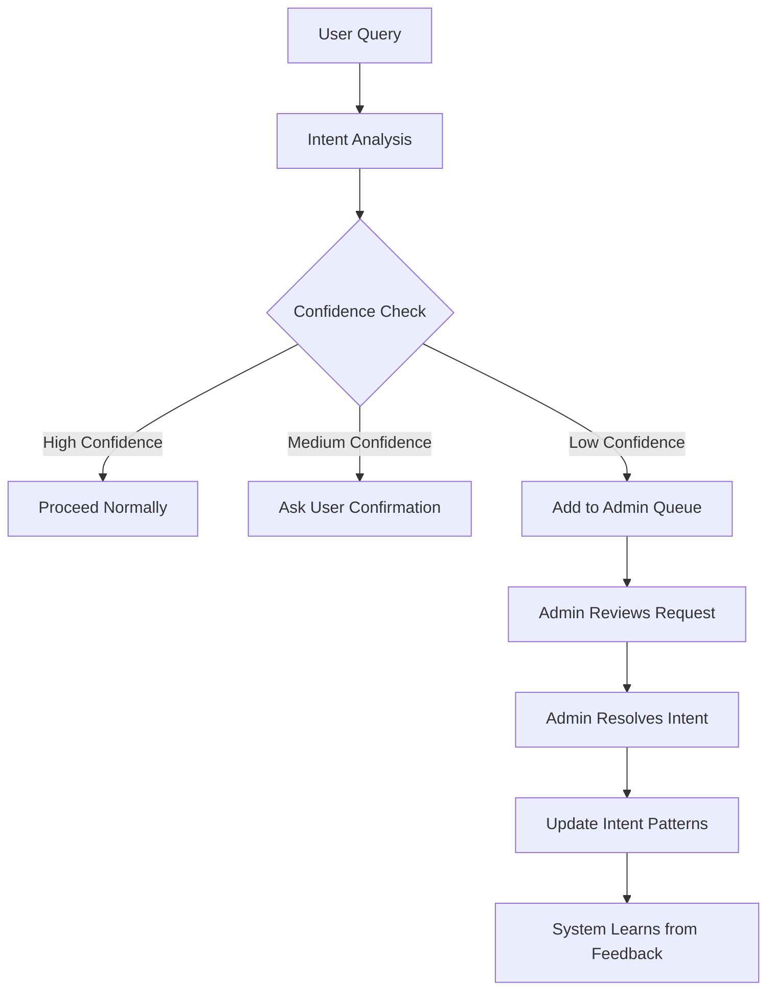

# Intent Management System Documentation

## Overview

The Intent Management System is a sophisticated AI learning framework that enables the AI to understand user requests more accurately and continuously improve its intent recognition capabilities. This system combines uncertainty management, admin review workflows, and self-learning mechanisms to ensure the AI never makes assumptions when it's unsure.

## System Architecture

### Core Components

1. **Intent Pattern Recognition**
   - Dynamic intent patterns stored in SQLite database
   - Confidence-based decision making
   - Keyword and tag-based matching
   - Context-aware requirements

2. **Uncertainty Management**
   - Confidence threshold system
   - Automatic admin review queue
   - Priority-based escalation
   - Learning from admin feedback

3. **Self-Learning Mechanisms**
   - Wiki knowledge integration
   - Usage pattern tracking
   - Admin feedback incorporation
   - Dynamic pattern expansion

4. **Admin Review System**
   - Comprehensive review interface
   - Intent confirmation/correction
   - Learning notes integration
   - Audit trail maintenance

## Intent Pattern Structure

### Database Schema

```sql
CREATE TABLE intent_patterns (
    id INTEGER PRIMARY KEY AUTOINCREMENT,
    intent_name TEXT NOT NULL,
    keywords TEXT NOT NULL, -- JSON array of keywords
    tags TEXT NOT NULL, -- JSON array of tags
    context_needed TEXT NOT NULL, -- JSON array of required context
    requirements TEXT NOT NULL, -- JSON array of requirements
    confidence_score REAL DEFAULT 0.5,
    usage_count INTEGER DEFAULT 0,
    created_at TIMESTAMP DEFAULT CURRENT_TIMESTAMP,
    last_updated TIMESTAMP DEFAULT CURRENT_TIMESTAMP
);

CREATE TABLE intent_learning_logs (
    id INTEGER PRIMARY KEY AUTOINCREMENT,
    pattern_id INTEGER,
    action TEXT NOT NULL, -- 'created', 'updated', 'deleted', 'used'
    admin_user_id TEXT,
    details TEXT, -- JSON details about the action
    created_at TIMESTAMP DEFAULT CURRENT_TIMESTAMP,
    FOREIGN KEY (pattern_id) REFERENCES intent_patterns(id)
);

CREATE TABLE wiki_knowledge (
    id INTEGER PRIMARY KEY AUTOINCREMENT,
    source_url TEXT NOT NULL,
    content_type TEXT NOT NULL, -- 'page', 'section', 'mechanics'
    title TEXT NOT NULL,
    content TEXT NOT NULL,
    extracted_keywords TEXT, -- JSON array
    extracted_intents TEXT, -- JSON array
    confidence_score REAL DEFAULT 0.5,
    created_at TIMESTAMP DEFAULT CURRENT_TIMESTAMP,
    last_updated TIMESTAMP DEFAULT CURRENT_TIMESTAMP
);
```

### Intent Pattern Example

```json
{
    "intent_name": "fishing",
    "keywords": ["fishing", "fish", "net", "pole", "boat", "captcha", "mibs"],
    "tags": ["fishing", "boating", "seafaring", "gathering"],
    "context_needed": ["fishing mechanics", "boat handling", "captcha detection"],
    "requirements": ["boat startup", "captcha solving", "net management"],
    "confidence_score": 0.85,
    "usage_count": 127
}
```

## Uncertainty Management

### Confidence Thresholds

| Confidence Level | Threshold | Action | Admin Review Required |
|------------------|-----------|---------|----------------------|
| HIGH_CONFIDENCE | 0.8+ | Proceed normally | No |
| MEDIUM_CONFIDENCE | 0.5-0.8 | Ask user for confirmation | Optional |
| LOW_CONFIDENCE | 0.3-0.5 | Request admin review | Yes |
| VERY_LOW_CONFIDENCE | <0.3 | Immediate admin review | Yes (High Priority) |

### Uncertainty Analysis Process

1. **Intent Detection**: Analyze user query against existing patterns
2. **Confidence Calculation**: Determine confidence score based on:
   - Keyword matching accuracy
   - Pattern usage frequency
   - Context availability
   - Historical success rate
3. **Threshold Evaluation**: Compare confidence against thresholds
4. **Action Determination**: Decide whether to proceed, ask user, or request admin review
5. **Admin Queue Management**: Add uncertain requests to review queue with appropriate priority

### Admin Review Workflow



## Self-Learning Mechanisms

### Wiki Knowledge Integration

The system automatically scrapes and processes UO Outlands wiki content to expand its understanding:

1. **Content Scraping**: Automated scraping of relevant wiki pages
2. **Knowledge Extraction**: Extract keywords, mechanics, and intent patterns
3. **Pattern Enhancement**: Use wiki data to expand existing intent patterns
4. **Confidence Boosting**: Wiki-backed patterns receive higher confidence scores

### Usage-Based Learning

- **Pattern Usage Tracking**: Monitor which intent patterns are used most frequently
- **Success Rate Analysis**: Track the success rate of each intent pattern
- **Confidence Adjustment**: Automatically adjust confidence scores based on outcomes
- **Pattern Evolution**: Expand or refine patterns based on usage patterns

### Admin Feedback Integration

- **Intent Confirmation**: Admins can confirm or correct detected intents
- **Learning Notes**: Admins can add context and learning notes
- **Pattern Updates**: System automatically updates patterns based on admin feedback
- **Audit Trail**: Complete history of all admin modifications and decisions

## API Endpoints

### Intent Management

```http
GET /api/ai/intents/patterns
GET /api/ai/intents/patterns/{id}
PUT /api/ai/intents/patterns/{id}
POST /api/ai/intents/patterns
DELETE /api/ai/intents/patterns/{id}
GET /api/ai/intents/analytics
GET /api/ai/intents/learning-logs
```

### Uncertainty Management

```http
GET /api/ai/uncertainty/pending-reviews
GET /api/ai/uncertainty/stats
POST /api/ai/uncertainty/resolve/{id}
POST /api/ai/uncertainty/analyze
GET /api/ai/uncertainty/admin-dashboard
```

### Request/Response Examples

#### Get Intent Patterns
```http
GET /api/ai/intents/patterns?user_id=123&is_admin=true
```

**Response:**
```json
{
    "patterns": [
        {
            "id": 1,
            "intent_name": "fishing",
            "keywords": ["fishing", "fish", "net", "pole"],
            "tags": ["fishing", "boating"],
            "context_needed": ["fishing mechanics"],
            "requirements": ["boat startup"],
            "confidence_score": 0.85,
            "usage_count": 127,
            "last_updated": "2024-01-15T10:30:00Z"
        }
    ],
    "count": 1
}
```

#### Analyze Uncertainty
```http
POST /api/ai/uncertainty/analyze
Content-Type: application/json

{
    "query": "I need help with something",
    "detected_intent": {"intent": "general", "confidence": 0.3},
    "confidence_score": 0.3
}
```

**Response:**
```json
{
    "uncertainty_analysis": {
        "confidence_score": 0.3,
        "uncertainty_level": "LOW_CONFIDENCE",
        "uncertainty_reason": "Low confidence - intent unclear or ambiguous",
        "suggested_action": "Ask user for clarification and request admin review",
        "needs_admin_review": true,
        "can_proceed": false,
        "should_ask_user": false,
        "request_id": 42
    },
    "response_message": "I'm not entirely sure what you're looking for. I've flagged this for admin review to get you the best help possible.",
    "recommended_action": "Ask user for clarification and request admin review"
}
```

## Admin Interface

### Uncertainty Reviews Tab

The admin interface provides comprehensive tools for managing uncertain AI requests:

#### Features
- **Priority Queue**: High-priority uncertain requests appear first
- **Context Display**: Full user query, detected intent, and uncertainty reason
- **Resolution Interface**: Confirm, correct, or expand intent understanding
- **Learning Integration**: Add notes that improve future AI responses
- **Batch Operations**: Handle multiple requests efficiently

#### Review Process
1. **View Request**: See user query and AI's detected intent
2. **Assess Context**: Review uncertainty reason and confidence score
3. **Make Decision**: Confirm correct intent or provide correction
4. **Add Notes**: Include learning context for future improvement
5. **Resolve**: Submit resolution to update intent patterns

### Intent Management Tab

The intent management interface allows admins to view and modify intent patterns:

#### Features
- **Pattern Overview**: See all intent patterns with usage statistics
- **Edit Interface**: Modify keywords, tags, context, and requirements
- **Analytics Dashboard**: Track pattern usage and effectiveness
- **Learning Logs**: Review all modifications and improvements

#### Management Operations
1. **View Patterns**: Browse all intent patterns with statistics
2. **Edit Patterns**: Modify pattern components to improve accuracy
3. **Monitor Usage**: Track which patterns are most effective
4. **Optimize Performance**: Improve intent detection based on analytics

## Configuration

### Environment Variables

```bash
# Intent Management
INTENT_CONFIDENCE_HIGH=0.8
INTENT_CONFIDENCE_MEDIUM=0.5
INTENT_CONFIDENCE_LOW=0.3
INTENT_CONFIDENCE_VERY_LOW=0.1

# Wiki Integration
WIKI_BASE_URL=https://wiki.uooutlands.com
WIKI_SCRAPING_ENABLED=true
WIKI_UPDATE_INTERVAL=86400  # 24 hours

# Admin Review
ADMIN_REVIEW_ENABLED=true
ADMIN_REVIEW_PRIORITY_HIGH=3
ADMIN_REVIEW_PRIORITY_MEDIUM=2
ADMIN_REVIEW_PRIORITY_LOW=1
```

### Database Configuration

```python
# Intent pattern matching weights
KEYWORD_WEIGHT = 0.4
TAG_WEIGHT = 0.3
CONTEXT_WEIGHT = 0.2
USAGE_WEIGHT = 0.1

# Confidence calculation parameters
BASE_CONFIDENCE = 0.5
USAGE_BOOST_FACTOR = 0.1
WIKI_BOOST_FACTOR = 0.2
```

## Best Practices

### For Admins

#### Reviewing Uncertain Requests
1. **Read Full Context**: Always review the complete user query
2. **Consider Intent Nuance**: Look for subtle differences in user intent
3. **Add Learning Notes**: Provide context that helps the AI learn
4. **Be Consistent**: Maintain consistent intent classifications
5. **Monitor Patterns**: Watch for recurring uncertainty issues

#### Managing Intent Patterns
1. **Regular Review**: Periodically review pattern effectiveness
2. **Keyword Optimization**: Keep keywords relevant and comprehensive
3. **Tag Consistency**: Use consistent tagging for similar intents
4. **Context Updates**: Update context requirements as game mechanics change
5. **Usage Monitoring**: Track which patterns are most/least used

### For Users

#### Getting Better AI Responses
1. **Be Specific**: Provide detailed context about what you want
2. **Use Clear Language**: Avoid ambiguous terms and abbreviations
3. **Provide Examples**: Give examples of similar scripts or behaviors
4. **Include Requirements**: Mention specific requirements or constraints
5. **Ask Follow-ups**: Use follow-up questions to refine the AI's understanding

## Monitoring and Analytics

### Key Metrics

#### Intent Recognition Performance
- **Accuracy Rate**: Percentage of correctly identified intents
- **Confidence Distribution**: Distribution of confidence scores
- **Admin Review Rate**: Percentage of requests requiring admin review
- **Resolution Time**: Average time to resolve uncertain requests

#### Pattern Effectiveness
- **Usage Frequency**: How often each pattern is triggered
- **Success Rate**: Success rate of each intent pattern
- **Confidence Trends**: How confidence scores change over time
- **Learning Impact**: Effectiveness of admin feedback on improvements

#### System Health
- **Response Times**: Time to process intent analysis
- **Database Performance**: Query performance and optimization
- **Admin Workload**: Number of reviews per admin per day
- **Learning Rate**: How quickly the system improves from feedback

### Dashboard Views

#### Admin Dashboard
- **Pending Reviews**: Current uncertain requests needing attention
- **Recent Activity**: Recent intent pattern updates and modifications
- **Top Uncertainty Reasons**: Most common reasons for uncertainty
- **Performance Trends**: Charts showing system improvement over time

#### Analytics Dashboard
- **Intent Usage**: Most and least used intent patterns
- **Confidence Analytics**: Distribution and trends of confidence scores
- **Learning Effectiveness**: Impact of admin feedback on system improvement
- **Wiki Integration**: Status and effectiveness of wiki knowledge integration

## Troubleshooting

### Common Issues

#### High Uncertainty Rates
**Symptoms**: Many requests requiring admin review
**Causes**: 
- Insufficient or outdated intent patterns
- New game mechanics not covered
- Ambiguous user queries
**Solutions**:
- Review and update intent patterns
- Add new patterns for emerging game mechanics
- Improve user guidance on query specificity

#### Low Pattern Usage
**Symptoms**: Some intent patterns rarely triggered
**Causes**:
- Keywords too specific or outdated
- Patterns not matching user language
- Game mechanics changed
**Solutions**:
- Review and expand keyword lists
- Update patterns based on current game state
- Consider pattern consolidation or removal

#### Slow Admin Review Process
**Symptoms**: Long delays in resolving uncertain requests
**Causes**:
- High volume of uncertain requests
- Complex requests requiring extensive review
- Admin availability issues
**Solutions**:
- Optimize confidence thresholds
- Improve intent pattern accuracy
- Implement batch review capabilities

### Performance Optimization

#### Database Optimization
```sql
-- Create indexes for better performance
CREATE INDEX idx_intent_patterns_keywords ON intent_patterns(keywords);
CREATE INDEX idx_intent_patterns_tags ON intent_patterns(tags);
CREATE INDEX idx_intent_patterns_usage ON intent_patterns(usage_count DESC);
CREATE INDEX idx_uncertainty_requests_priority ON uncertainty_requests(priority DESC);
CREATE INDEX idx_uncertainty_requests_status ON uncertainty_requests(status);
```

#### Caching Strategies
- **Pattern Caching**: Cache frequently used intent patterns
- **Confidence Caching**: Cache confidence calculations for similar queries
- **Wiki Knowledge Caching**: Cache processed wiki content
- **Admin Review Caching**: Cache admin review decisions for similar cases

## Future Enhancements

### Planned Features

#### Advanced Learning
- **Machine Learning Integration**: Use ML models for intent classification
- **Neural Pattern Recognition**: Advanced pattern matching algorithms
- **Predictive Confidence**: Predict confidence before full analysis
- **Automated Pattern Generation**: AI-generated intent patterns from user data

#### Enhanced Wiki Integration
- **Real-time Updates**: Automatic wiki content updates
- **Content Validation**: Verify wiki content accuracy
- **Multi-source Integration**: Integrate multiple knowledge sources
- **Semantic Analysis**: Advanced content understanding and extraction

#### Improved Admin Tools
- **Bulk Operations**: Handle multiple requests simultaneously
- **Advanced Analytics**: Detailed performance and usage analytics
- **Automated Suggestions**: AI-suggested pattern improvements
- **Collaboration Tools**: Multi-admin review workflows

### Integration Opportunities

#### External Systems
- **Discord Bot Integration**: Direct Discord intent analysis
- **Game Client Integration**: Real-time intent detection from game context
- **Community Tools**: Integration with community script repositories
- **Learning Platforms**: Integration with tutorial and learning systems

## Support and Maintenance

### Regular Maintenance Tasks

#### Daily
- Review pending uncertain requests
- Monitor system performance metrics
- Check for new wiki content updates
- Review admin feedback and learning notes

#### Weekly
- Analyze intent pattern usage trends
- Review and optimize confidence thresholds
- Update intent patterns based on game changes
- Clean up outdated or unused patterns

#### Monthly
- Comprehensive system performance review
- Database optimization and cleanup
- Wiki knowledge base updates
- Admin training and feedback sessions

### Support Resources

#### Documentation
- This intent management guide
- Admin interface documentation
- API endpoint documentation
- Troubleshooting guides

#### Training Materials
- Admin onboarding documentation
- Best practices guides
- Video tutorials for admin interface
- Regular training sessions

#### Community Support
- Admin discussion forums
- Regular admin meetings
- Feedback collection systems
- Continuous improvement processes

The Intent Management System represents a significant advancement in AI understanding and learning capabilities, providing a robust framework for continuous improvement and accurate intent recognition while maintaining human oversight and control.
